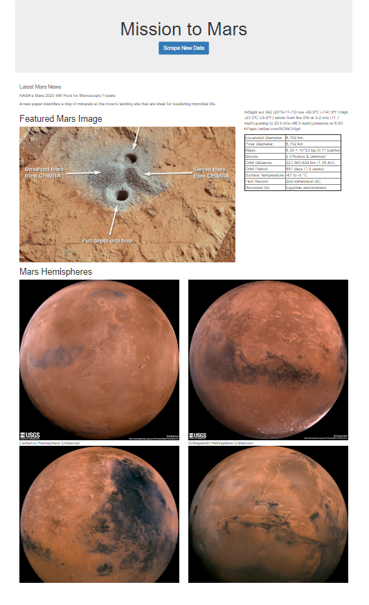

# web-scraping-nasa

Author:  Erin James Wills, ejw.data@gmail.com  

<cite>Photo by [NASA](https://unsplash.com/@nasa?utm_source=unsplash&utm_medium=referral&utm_content=creditCopyText) on [Unsplash](https://unsplash.com/s/photos/space?utm_source=unsplash&utm_medium=referral&utm_content=creditCopyText)</cite>

 

## Overview  

This repo uses Requests, Splinter (with Selenium), and BeautifulSoup to collect data from several NASA websites.  Information collected includes the latest news stories, images, and tables related to Mars. The webscraping for this project was tested in a Jupyter Notebook called `mission_to_mars.ipynb`.  No other tools are needed to run this logic. See instructions below for more details.   

To create a user friendly version, the scrape logic was added to a python script file (`scrape_mars.py`) which is called by a flask app (`app.py`) that serves a simple webpage with a button that triggers the scrape to run.  All data collected from this scrape is stored in a MongoDB collection.  The flask app can be run locally if you also have MongoDB installed.  Instructions are provided below.    

 

## Technologies  
*  Python
*  MongoDB
*  Splinter
*  BeautifulSoup
*  Requests

   

## Data Source  

The dataset is generated by scrapting the following websites:  
*  [https://mars.nasa.gov/news/](https://mars.nasa.gov/news/)   
*  [https://www.jpl.nasa.gov](https://www.jpl.nasa.gov)  
*  [https://twitter.com/marswxreport?lang=en](https://twitter.com/marswxreport?lang=en)
*  [https://space-facts.com/mars/](https://space-facts.com/mars/)
*  [https://astrogeology.usgs.gov/search/results?q=hemisphere+enhanced&k1=target&v1=Mars](https://astrogeology.usgs.gov/search/results?q=hemisphere+enhanced&k1=target&v1=Mars)  

**`Note:`** The above links could change and cause the project to break.  This was not a project emphasizing long-term reliability but instead is a project testing out different technologies such as when to use Splinter verus BeautifulSoup.  

 

## Setup and Installation  
1. Environment needs the following:  
    *  Python 3.6+  
    *  pandas
    *  webdriver_manager.chrome
    *  splinter
    *  BeautifulSoup
    *  requests
    *  time
    *  flask
    *  flask_pymongo
1. Verify that your MongoDB server is running by starting MongoDB Compass and connecting into the service.  
1. Activate your environment
1. Clone the repo to your local machine
1. Start Jupyter Notebook within the environment from the repo
1. To run and/or troubleshoot the scraping, run `mission_to_mars.ipynb`.  
1. To run the the flask app:
   *   Open a new terminal with a present working directory being your repo folder
   *   Activate your environment
   *   In terminal run:  `python app.py`
   *   You should be able to go to a browser and see the scrape website from `http://localhost:5000`.
   *   The scrape will run and update the MongoDB database and webpage after clicking the scrape button.   
1.  The MongoDB database is automatically created if it does not exist and will be named:  `mars_app` and the collection will be named: `listings`.  

 

 

